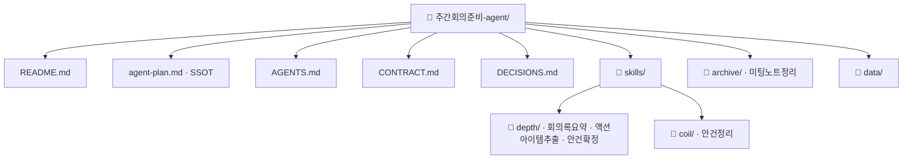

# 주간회의준비 팀 에이전트 기획서

> 이 문서가 에이전트 정보의 유일한 원본(SSOT)이다. 다른 문서는 여기를 가리킨다.

## 1. 팀과 목적
- 팀 미션: 매주 팀 회의를 준비한다.
- 이 흐름이 줄이는 일: 회의록 요약, 액션아이템 정리, 다음 주 안건 초안. 지금은 팀원 한 명이 매주 금요일 두 시간을 쓴다.
- 출처 업무: 주간 회의 준비

## 2. 에이전트 역할 정의
- 한 문장 정의: 이번 주 회의록에서 액션아이템과 다음 주 안건 초안을 뽑아 팀장 확인 앞에서 멈추는 보조 에이전트.
- **하는 일**
  - 회의록 요약, 액션아이템 추출·기록, 안건 초안 작성·기록
- **하지 않는 일**
  - 회의 공지 발송, 안건 순서의 최종 결정, 회의록 원문 수정

## 3. 데이터 명세
| 표 이름 | 칸 이름 | 원본 위치(SSOT) | 읽기/쓰기 |
| --- | --- | --- | --- |
| 회의록목록.csv | 파일명, 일자, 주제 | data/ | 읽기(회의록요약) |
| 액션아이템.csv | 담당, 내용, 기한 | data/ | 쓰기(액션아이템추출) · 읽기(안건정리) |
| 주간안건.csv | 안건, 출처, 우선순위 | data/ | 쓰기(안건정리) |

## 4. 대표 시나리오
- 트리거: 이번 주 회의록이 회의록목록.csv에 등록됨 (매주 금요일)
- 입력: 회의록
- 처리: 회의록요약 → 액션아이템추출 → 안건정리 → 안건확정
- 출력: 회의요약 · 액션아이템목록 · 주간안건초안 · 확정안건

## 5. 결과물 반영 규칙
- 액션아이템추출이 액션아이템.csv의 담당·내용·기한 칸에 기록한다.
- 안건정리가 주간안건.csv의 안건·출처·우선순위 칸에 기록한다.
- 회의록요약과 안건확정은 어떤 표에도 기록하지 않는다.

## 6. 연동 맵
- 현재는 독립. 확정안건을 회의 공지 에이전트에 넘기는 연동은 팀이 필요를 확인한 뒤 계약에 추가한다.

## 7. 검증·휴먼인더루프 지점
- 안건확정(사람고유): 팀장이 안건 초안을 확인하고 순서를 정한다. 검수 지점이 여기다. 임계값은 없다.

## 8. 폴더 트리

사분면 배치 이유:
- 회의록요약 → depth/: 회의록 하나를 읽어 한 번에 끝난다
- 액션아이템추출 → depth/: 요약 하나에서 표 하나에 기록하고 끝난다
- 안건정리 → coil/: 매주 금요일 반복해 도는 흐름의 일부다
- 안건확정 → depth/: 초안 하나를 사람이 한 번 확인한다
