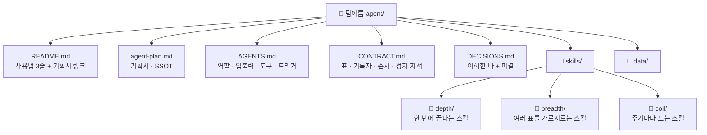

# [팀 이름] 팀 에이전트 기획서

> 이 문서가 에이전트 정보의 유일한 원본(SSOT)이다. 다른 문서는 여기를 가리킨다.

> 워크플로우 설계는 필요한 절만 쓴다. 실행 팩을 요청한 경우 8절을 유지한다. 자료에 없으면 미확인, 불필요하면 해당 없음, 제안이면 추정, 근거가 다르면 충돌로 표시한다. 서식의 빈칸은 질문 목록이 아니다.

- 상태: 초안 / 설계 완료 (실행 미검증) / 실행 검증 완료와 증거
- 미확인·충돌 및 해당 단계의 실행 보류 이유:
- 재개할 다음 질문: (설계가 충분하면 없음)

## 1. 팀과 목적
- 팀 미션:
- 이 흐름이 줄이는 일과 지금 쓰는 시간·주기:
- 출처 업무: (설계도의 상위 업무 이름이 있으면 적는다)

## 2. 에이전트 역할 정의
- 한 문장 정의:
- **하는 일**
  -
- **하지 않는 일**
  -

## 3. 데이터 명세
입력 종류·공급처·형식과 필요한 항목을 적는다. 문서·메시지·파일도 유효하다. 아래 표는 실제 표/DB를 쓰는 업무에만 채우며 없는 표를 만들지 않는다.
| 표 이름 | 칸 이름 | 원본 위치(SSOT) | 읽기/쓰기 |
| --- | --- | --- | --- |
|  |  |  |  |

## 4. 대표 시나리오
- 트리거:
- 입력:
- 처리: 첫스킬 → 다음스킬 → 끝스킬
- 출력:
- 수신자와 완료 기준:

| 단계 | 담당(스킬/사람/미구현) | 입력·공급처 | 행동 | 출력 | 다음 조건 |
| --- | --- | --- | --- | --- | --- |

분기 조건, 병렬 합류 조건, 부모 안의 하위 호출을 구분한다. 제안한 순서는 추정으로 표시하고 확인된 것만 실행 팩의 계약에 반영한다.

## 5. 결과물 반영 규칙
- 결과를 어디에 어떤 형식으로 전달/저장하는가:
- 표/DB를 갱신하는 경우만 표·필드·기록 담당:

## 6. 연동 맵
- 다른 스킬·에이전트와의 연결. 없으면 "현재는 독립".
- 사용 도구·접근 가능 여부와 실행 권한, 필요한 시간·비용 제약:

## 7. 검증·휴먼인더루프 지점
- 사람이 확인하고 멈추는 스킬과 그 이유. 임계값이 있으면 계약과 같은 형식(±N%)으로.
- 입력 누락/실패 시 처리와 재개 조건:
- 정상 입력·잘못된 입력으로 확인할 결과. 실행했다면 관찰 증거, 아니면 미실행:

## 8. 폴더 트리
실행 팩을 만들 때만 에이전트가 배치한다. 설계 인터뷰에서 사용자에게 사분면을 묻지 않는다.

사분면 배치 이유 (스킬마다 한 줄):
-
