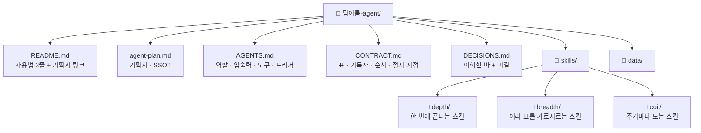

# [팀 이름] 팀 에이전트 기획서

> 이 문서가 에이전트 정보의 유일한 원본(SSOT)이다. 다른 문서는 여기를 가리킨다.

## 1. 팀과 목적
- 팀 미션:
- 이 흐름이 줄이는 일과 지금 쓰는 시간·주기:
- 출처 업무: (설계도의 상위 업무 이름이 있으면 적는다)

## 2. 에이전트 역할 정의
- 한 문장 정의:
- **하는 일**
  -
- **하지 않는 일**
  -

## 3. 데이터 명세
| 표 이름 | 칸 이름 | 원본 위치(SSOT) | 읽기/쓰기 |
| --- | --- | --- | --- |
|  |  |  |  |

## 4. 대표 시나리오
- 트리거:
- 입력:
- 처리: 첫스킬 → 다음스킬 → 끝스킬
- 출력:

## 5. 결과물 반영 규칙
- 어떤 결과가 어떤 표의 어떤 칸에:

## 6. 연동 맵
- 다른 스킬·에이전트와의 연결. 없으면 "현재는 독립".

## 7. 검증·휴먼인더루프 지점
- 사람이 확인하고 멈추는 스킬과 그 이유. 임계값이 있으면 계약과 같은 형식(±N%)으로.

## 8. 폴더 트리

사분면 배치 이유 (스킬마다 한 줄):
-
